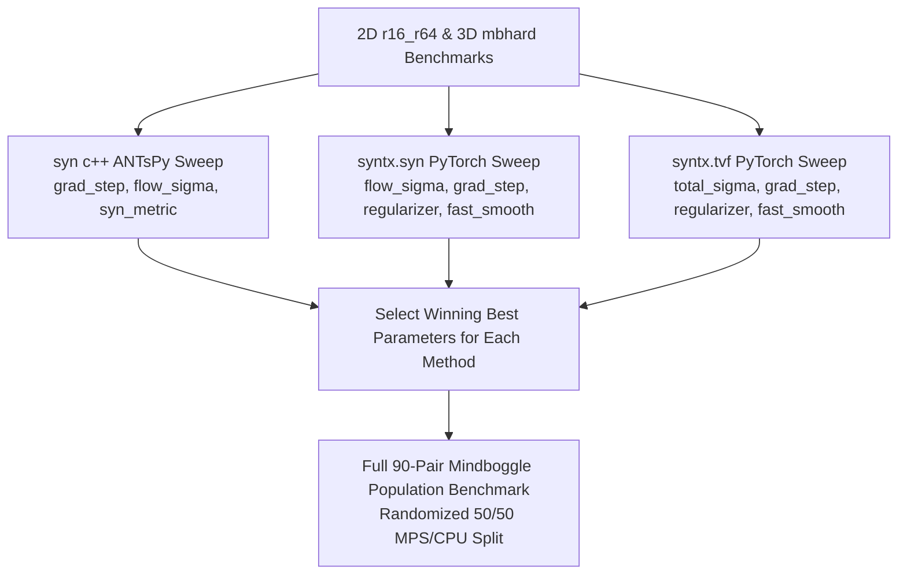

# Systematic Parameter Optimization & 90-Pair Mindboggle Benchmarking Plan

> **Technical Implementation Plan & Protocol Specification**
>
> This plan specifies a unified, systematic benchmarking protocol to identify the peak-performing parameter configurations for **`syn c++` (ANTsPy)**, **`syntx.syn` (PyTorch)**, and **`syntx.tvf` (PyTorch)** identically on both `r16_r64` (2D) and `mbhard` (3D) datasets, and culminate in the full 90-pair Mindboggle population benchmark with a **randomized 50/50 MPS/CPU allocation**.

---

## 1. Objectives & Overview

1. **Parameter Optimization Phase (`r16_r64` and `mbhard`)**:
   - Evaluate `syn c++`, `syntx.syn`, and `syntx.tvf` **in the exact same way** across systematic parameter grids on both 2D brain (`r16_r64`) and 3D Mindboggle hard (`mbhard`) datasets.
   - Use identical baseline initial affine transforms (`syntx.robust_affine`), native physical NIfTI headers, nearest-neighbor label warping, and 9 physical metrics.
   - Select the single best-performing parameter set for each algorithm based on symmetric Dice, topology regularity ($\det J > 0$), and inverse identity error.

2. **90-Pair Mindboggle Population Benchmark (Culmination)**:
   - Run all 90 Mindboggle population pairs (`examples/pairs.csv`) using the winning best parameter configurations.
   - **Hardware Allocation Split**: Randomly assign **50% of PyTorch runs to MPS** (`device='mps'`, 45 pairs) and **50% to CPU** (`device='cpu'`, 45 pairs) using deterministic seed `seed=42`.
   - Update `docs/provenance/best_parameters.json` and publish final population findings.

---

## 2. Parameter Sweep Specifications

Each algorithm will undergo parameter characterization on `r16_r64` and `mbhard`:

### 2.1 ANTs C++ SyN (`syn c++`) Parameter Grid
- `grad_step` $\in \{0.10, 0.25, 0.50\}$
- `flow_sigma` $\in \{1.0, 3.0, 4.0\}$
- `syn_metric` $\in \{\text{'cc'}, \text{'mattes'}\}$
- Pyramids: `[100, 100, 20]`

### 2.2 PyTorch SyN (`syntx.syn`) Parameter Grid
- `flow_sigma` $\in \{1.0, 3.0, 4.0\}$
- `grad_step` $\in \{0.10, 0.25, 0.50\}$
- `regularizer` $\in \{\text{'gaussian'}, \text{'sobolev'}, \text{'dsti'}\}$
- `fast_smooth` $\in \{\text{False}, \text{True}\}$
- `use_analytical_gradients` $\in \{\text{True}, \text{False}\}$
- Pyramids: `[100, 100, 20]`

### 2.3 PyTorch TVF (`syntx.tvf`) Parameter Grid
- `total_sigma` $\in \{0.05, 0.20, 0.50\}$
- `grad_step` $\in \{0.211, 0.50, 0.90\}$
- `regularizer` $\in \{\text{'gaussian'}, \text{'sobolev'}, \text{'dsti'}\}$
- `fast_smooth` $\in \{\text{True}, \text{False}\}$
- Pyramids: `[80, 80, 20]`, `solver='euler'`, `n_time_steps=3`

---

## 3. Standardized Evaluation Metric Suite

For every combination and pair, the benchmark calculates:

1. **`dice_fixed`**: Fixed space segmentation Dice (nearest-neighbor warping)
2. **`dice_moving`**: Moving space segmentation Dice (nearest-neighbor warping)
3. **`dice_sym`**: Symmetric Mean Dice $0.5 \times (\text{dice\_fixed} + \text{dice\_moving})$
4. **`fold_pct`**: Grid folding percentage ($\det J \le 0$, evaluated with `do_log=False`)
5. **`min_detJ`**: Minimum Jacobian determinant in brain mask
6. **`e_mean`**: Mean physical inverse identity mapping error (mm)
7. **`e_p95`**: 95th percentile physical inverse identity mapping error (mm)
8. **`e_max`**: Maximum physical inverse identity mapping error (mm)
9. **`time_s`**: Total wall-clock execution runtime (seconds)

---

## 4. 90-Pair Mindboggle Population Protocol

1. **Randomized Hardware Split**:
   - `seed=42`: Exactly 45 pairs allocated to `device='mps'`, 45 pairs allocated to `device='cpu'`.
   - Interleaved randomly across all sub-cohorts (`OASIS-TRT-20`, `MMRR-21`, `NKI-RS-22`, `NKI-TRT-20`, `Extra-18`).
2. **Shared Initial Alignment**:
   - Every pair computes a shared initial affine matrix via `syntx.robust_affine(fixed, moving, multi_start=True, mode='pytorch')`.
   - All three algorithms (`syn c++`, `syntx.syn`, `syntx.tvf`) receive this exact same transform.
3. **Native Physical NIfTI Headers**:
   - No header reorientation or pre-processing.
4. **Incremental Output**:
   - Results saved to `docs/provenance/mindboggle_90pair_fair_results.json` after EVERY pair.
   - Provenance summary updated in `docs/provenance/best_parameters.json`.

---

## 5. Implementation Deliverables

1. **Unified Optimization Script**: `scripts/run_systematic_optimization_and_90pair.py`
2. **2D Optimization Results**: `docs/provenance/phase1_2d_optimization.json`
3. **3D Optimization Results**: `docs/provenance/phase2_3d_optimization.json`
4. **Winning Best Parameters Summary**: Saved in `docs/provenance/best_parameters.json`
5. **90-Pair Population Benchmark**: `docs/provenance/mindboggle_90pair_fair_results.json`
