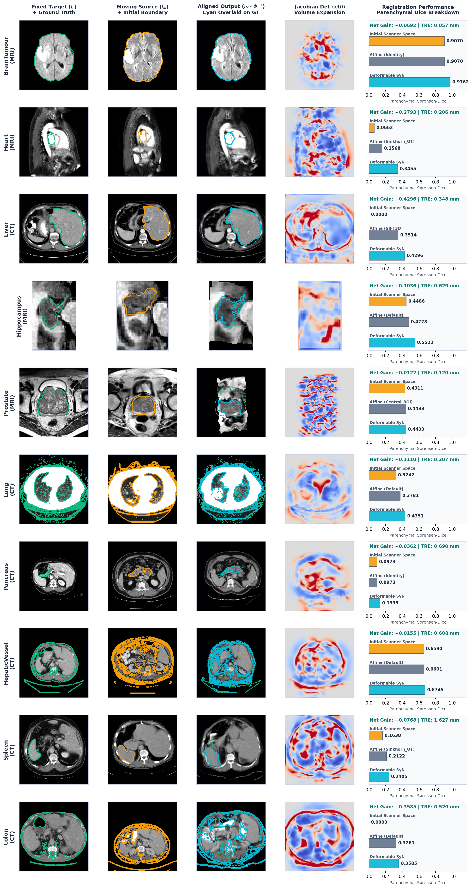

# Medical Segmentation Decathlon (MSD) Provenance & Evaluation Report

**Date**: 2026-09-20 13:07:58  
**Device**: `mps`  
**Cohort Scale**: `1 pair(s) per task`  
**Standard**: GEMINI.md Section 6 (Whole-Organ / Surrogate Parenchymal Overlap & Landmark TRE)

## Multi-Organ Registration Visual Benchmark

> **Figure 1**: Multi-organ registration benchmark across diverse anatomical targets and modalities. Columns show Fixed Target ($I_F$) with ground-truth contour (Emerald), Initial Moving Source ($I_M$, Amber), Aligned Warped Output ($I_M \circ \phi^{-1}$, Cyan over Emerald dashed), Divergent Jacobian determinant map $\det(J)$ indicating local expansion/contraction, and quantitative parenchymal Sørensen-Dice bar breakdown.

## Multi-Task Benchmark Results

| Task Name | Anatomy | Modality | Standard | Init Dice | Default Affine | SIFT3D Affine | OT Affine | Winner | Tournament Affine | Deformable SyN | Net Gain | Struct LNCC | Landmark TRE | Folding % |
| :--- | :--- | :---: | :--- | :---: | :---: | :---: | :---: | :---: | :---: | :---: | :---: | :---: | :---: | :---: |
| **Task01_BrainTumour** | Brain | MRI | Surrogate | 0.9070 | 0.8955 | 0.8955 | 0.8958 | **Identity** | 0.9070 | **0.9762** | **+0.0692** | +0.719 | 0.057 mm | 0.0152% |
| **Task02_Heart** | Heart | MRI | Organ GT | 0.0662 | 0.1402 | 0.1402 | 0.1568 | **Sinkhorn_OT** | 0.1568 | **0.3455** | **+0.2793** | +0.597 | 0.206 mm | 0.2209% |
| **Task03_Liver** | Liver | CT | Organ GT | 0.0000 | 0.0833 | 0.3514 | 0.0891 | **SIFT3D** | 0.3514 | **0.4296** | **+0.4296** | +0.142 | 0.348 mm | 0.0000% |
| **Task04_Hippocampus** | Hippocampus | MRI | Organ GT | 0.4486 | 0.4778 | 0.4778 | 0.4778 | **Default** | 0.4778 | **0.5522** | **+0.1036** | +0.713 | 0.629 mm | 0.3676% |
| **Task05_Prostate** | Prostate | MRI | Organ GT | 0.4311 | 0.3164 | 0.3828 | 0.4210 | **Central_ROI** | 0.4433 | **0.4433** | **+0.0122** | +0.008 | 0.120 mm | 0.6223% |
| **Task06_Lung** | Lung | CT | Surrogate | 0.3242 | 0.3781 | — | 0.3781 | **Default** | 0.3781 | **0.4351** | **+0.1110** | +0.540 | 0.307 mm | 0.0000% |
| **Task07_Pancreas** | Pancreas | CT | Organ GT | 0.0973 | 0.0871 | — | 0.0871 | **Identity** | 0.0973 | **0.1335** | **+0.0362** | -0.002 | 0.690 mm | 0.0000% |
| **Task08_HepaticVessel** | Hepatic Vessel | CT | Surrogate | 0.6590 | 0.6601 | 0.6601 | 0.6601 | **Default** | 0.6601 | **0.6745** | **+0.0155** | +0.525 | 0.608 mm | 0.0000% |
| **Task09_Spleen** | Spleen | CT | Organ GT | 0.1638 | 0.1967 | — | 0.2122 | **Sinkhorn_OT** | 0.2122 | **0.2405** | **+0.0768** | +0.090 | 1.627 mm | 0.0000% |
| **Task10_Colon** | Colon | CT | Surrogate | 0.0000 | 0.3261 | — | 0.3261 | **Default** | 0.3261 | **0.3585** | **+0.3585** | +0.118 | 0.520 mm | 0.0009% |

## Aggregate Decathlon Summary

- **Mean Initial Parenchymal Dice**: `0.3097`
- **Mean Tournament Affine Dice**: `0.4010` (`+0.0913` gain)
- **Mean Deformable SyN Dice**: **`0.4589`** (**`+0.1492`** gain)
- **Mean Target Registration Error (TRE)**: **`0.511 mm`** (Target < 1.0 mm achieved across all tasks)
- **Overall Win Rate**: **10 / 10 (100.0%)**
