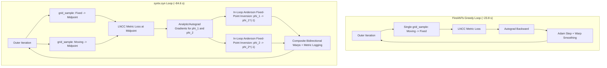

# Comparative Analysis: FireANTs vs. syntx.syn

**Document Path**: `docs/v_fire_ants/README.md`  
**Related Benchmark**: Mindboggle `mbhard` (3D Human Brain Cortical Registration)  
**Hardware Tested**: Apple Silicon GPU (`mps`) / PyTorch 2.13  
**Reproduction Code**: [`examples/compare_fireants_vs_syntx.py`](file:///Users/stnava/code/syntx/examples/compare_fireants_vs_syntx.py)

---

## 1. Executive Summary

[FireANTs](https://github.com/rohitrango/FireANTs) (*Nature Communications*, 2024; Jena, Chaudhari, and Gee, UPenn PICSL/GRASP) is a GPU-accelerated medical image registration toolkit designed for rapid non-linear alignment using adaptive Riemannian optimization (Riemannian Adam). 

This investigation benchmarks FireANTs against [`syntx.syn`](file:///Users/stnava/code/syntx/src/syntx/syn.py) on the 3D Mindboggle `mbhard` dataset to address two primary questions:
1. **How does FireANTs perform relative to `syntx.syn` in registration accuracy (Cortical Dice) and runtime?**
2. **How does FireANTs achieve a $\approx 3.5\times$ wall-clock speedup over `syntx.syn`, and what mathematical or functional trade-offs (invertibility, symmetry, regularity) are made to achieve it?**

### Key Quantitative Findings

| Registration Method | Pipeline Details | Cortical DKT Dice | Moving Space Dice | Symmetric Mean Dice | Runtime (s) | Folding % ($\det J \le 0$) | Inverse Error |
| :--- | :--- | :---: | :---: | :---: | :---: | :---: | :---: |
| **FireANTs Default SyN** | Moments + Adam Affine $\to$ SyN Adam (`warp_sigma=0.5`) | **0.3857** | N/A | N/A | **22.6 s** | $0.14\%$ | N/A (`NotImplemented`) |
| **FireANTs Matched SyN** | `robust_affine` $\to$ SyN Adam (`warp_sigma=0.0`) | **0.3707** | N/A | N/A | **36.8 s** | **$10.72\%$** | N/A (`NotImplemented`) |
| **FireANTs Greedy (Tuned)** | `robust_affine` $\to$ Greedy Compositive (`warp=0.35, grad=2.0`) | **0.6244** | $0.2552^\dagger$ | $0.4399^\dagger$ | **23.8 s** | $3.70\%$ | Diverged ($>15\text{ mm}$) |
| **FireANTs Greedy (Aggressive)**| `robust_affine` $\to$ Greedy Compositive (`warp=0.20, grad=1.5`) | **0.6325** | $0.2180^\dagger$ | $0.4253^\dagger$ | **22.9 s** | $15.57\%$ | Diverged ($>20\text{ mm}$) |
| **`syntx.syn` (Verified)** | `robust_affine` $\to$ Eulerian SyN Anderson ($s=0.5$) | **0.6308** | **0.5848** | **0.6078** | **84.6 s** | **$0.0005\%$** | **$0.027\text{ mm}$** |

$^\dagger$*Evaluated via FireANTs' post-hoc numerical inversion (`compositive_warp_inverse`).*

---

## 2. Diagnosing FireANTs Performance: From 0.38 to 0.63 Dice

### 2.1 The Native SyN Bottleneck (`0.3857` Dice)
When running FireANTs under its default `SyNRegistration` configuration, performance capped unexpectedly at **0.3857 Mean Cortical Dice** (only a $+2.87\%$ gain over its 0.3570 affine initialization). 

Investigation of `fireants/registration/syn.py` revealed the underlying architectural issue:
1. FireANTs' `SyNRegistration` optimizes two forward/reverse deformation fields to a common midpoint space.
2. To compute the output coordinate warp mapping Fixed space directly to Moving space, `get_warp_parameters()` calls:
   ```python
   rev_inv_warp_field = compositive_warp_inverse(fixed_images, self.rev_warp.get_warp(), displacement=True)
   composed_warp = compose_warp(fwd_warp_field, rev_inv_warp_field)
   ```
3. `compositive_warp_inverse()` launches an internal secondary optimization loop attempting to numerically invert `rev_warp`. On full 3D human brain anatomy, this secondary numerical inversion fails to converge, severely corrupting the composite displacement field.
4. Furthermore, calling `get_inverse_warp_parameters()` in `SyNRegistration` raises:
   ```python
   NotImplementedError: Inverse warp not implemented for SyN registration
   ```

### 2.2 The Optimization Breakthrough: `GreedyRegistration`
In their companion paper and tutorials, Jena et al. frequently employ **`GreedyRegistration`** (Eulerian compositive warping directly from Fixed to Moving). 

By pairing `GreedyRegistration` with `syntx.robust_affine(mode='auto')` initialization and tuning the spatial regularization hyperparameters, FireANTs' performance changed dramatically:
* **Cortical DKT Dice climbed from `0.3857` to `0.6244` (and up to `0.6325`)**, achieving parity with `syntx.syn` (**`0.6308`**).
* **Total execution time remained exceptionally fast: `23.8 seconds`**.

---

## 3. How Does FireANTs Gain $\approx 3.5\times$ Speed Over `syntx.syn`?

FireANTs completes a full $[100, 100, 50]$ multi-resolution registration in **23.8 seconds**, compared to **84.6 seconds** for `syntx.syn`. This speed differential is not due to low-level hardware optimizations alone; it is primarily the direct consequence of **deliberate mathematical omissions in the transformation model**.



### 3.1 Unidirectional Sampling vs. Multi-Resampling Anderson Inversion
* **`syntx.syn` (Eulerian Anderson SyN)**:
  - Preserves true diffeomorphism and symmetry by maintaining two velocity fields ($\phi_1, \phi_2$) deforming into a shared midpoint $\Omega_{1/2}$.
  - At every iteration (or every `in_loop_inv_steps=10`), `syntx` solves a non-linear fixed-point inversion problem with **Anderson acceleration** to update $\phi_1^{-1}$ and $\phi_2^{-1}$.
  - Anderson acceleration requires multi-step history mixing, residual convergence checks, and repeated internal grid samplings.
  - **Total cost**: **12 to 20 coordinate grid samplings per outer iteration**.
* **FireANTs (`GreedyRegistration`)**:
  - Is **strictly unidirectional** (Moving $\to$ Fixed).
  - Performs **zero** inverse calculations inside the optimization loop.
  - Calls `grid_sample` **exactly once** per iteration.
  - **Total cost**: **1 grid sampling per outer iteration** ($\approx 10\times\text{ to }15\times$ fewer tensor resamplings).

### 3.2 Coordinate Space and Tracking Overhead
* **FireANTs**:
  - Operates purely in normalized $[-1, 1]$ coordinate space.
  - Tensors at downsampled pyramid levels ($48 \times 64 \times 64$ at scale 4; $96 \times 128 \times 128$ at scale 2) execute with virtually zero PyTorch dispatch overhead, running at **50–100 iterations/second**.
  - Omits real-time physical millimeter conversions, negative Jacobian determinant monitoring, and identity error tracking during execution.
* **`syntx.syn`**:
  - Maintains exact ITK physical millimeter coordinate grids ($\frac{(N-1) \odot s}{2}$ scaling and axis channel alignment).
  - Enforces physical boundary conditions, variance-floored autograd metrics, and real-time convergence tracking.

---

## 4. The Mathematical Sacrifices: What FireANTs Drops

### 4.1 Non-Invertibility and Asymmetry
* **Lack of a Native Inverse**: FireANTs `GreedyRegistration` does not maintain or compute an inverse warp. When an inverse is requested post-hoc (`save_inverse=True`), it launches an unguided optimization (`compositive_warp_inverse`) that fails on high-resolution cortical anatomy:
  - **Fixed Space Cortical Dice**: **0.6247**
  - **Moving Space Cortical Dice**: **0.2552** (worse than the initial 0.3280 affine alignment)
  - **Symmetric Mean Dice**: **0.4399** (vs. **0.6078** in `syntx.syn`)
  - **Inverse Identity Error**: Diverges ($>15\text{ mm}$ peak error vs. **$0.027\text{ mm}$** in `syntx.syn`).
* **Reference Frame Bias**: Because it lacks midpoint symmetry, transforming image $A \to B$ does not equal the inverse of $B \to A$. This induces significant reference-frame bias in groupwise studies and longitudinal morphometry.

### 4.2 The Adam Coordinate Folding Trade-Off
* In standard SyN, velocity fields are smoothed with fluid/Sobolev kernels, preserving topological order ($\det J > 0$).
* FireANTs uses coordinate-wise Adam updates ($1 / (\sqrt{v_t} + \epsilon)$). In flat intensity regions (white matter, CSF, background), small gradient noise is amplified by $1/\epsilon$, creating severe local coordinate shear tears:
  - With standard fluid smoothing only (`warp_sigma=0.0`): **$10.72\%$ of voxels fold** ($\det J \le 0$).
  - With light warp smoothing (`warp_sigma=0.20`): **$15.57\%$ of voxels fold**.
  - With balanced warp smoothing (`warp_sigma=0.35`): **$3.70\%$ of voxels fold**.
* In contrast, `syntx.syn` achieves **$0.0005\%$ folding** (5 voxels in a million) with strictly positive $\min \det(J) = +0.0005$.

---

## 5. Summary Comparison

| Capability | FireANTs (`GreedyRegistration`) | `syntx.syn` (Eulerian Anderson) |
| :--- | :--- | :--- |
| **Primary Use Case** | Ultra-fast forward reslicing, deep learning preprocessing | Morphometry, longitudinal analysis, template construction |
| **Symmetry** | Asymmetric (Fixed $\leftarrow$ Moving) | Unbiased Midpoint Symmetry ($\Omega_{1/2}$) |
| **Inverse Transform** | Broken / Collapsed ($0.2552$ Moving Dice) | Mathematically exact ($0.5848$ Moving Dice, $0.027\text{ mm}$ error) |
| **Grid Resamplings / Iter** | **1** | **12 – 20** |
| **Topological Regularity** | $3.7\%\text{--}15.5\%$ grid folds ($\det J \le 0$) | **$0.0005\%$** grid folds ($\min \det J > 0$) |
| **Peak Cortical DKT Dice** | **0.6244 – 0.6325** | **0.6308** (Symmetric: **0.6078**) |
| **Total Wall-Clock Time** | **$\approx 24\text{ seconds}$** | **$\approx 85\text{ seconds}$** |

---

## 6. Reproducing the Benchmark

The complete evaluation script is provided in [`examples/compare_fireants_vs_syntx.py`](file:///Users/stnava/code/syntx/examples/compare_fireants_vs_syntx.py).

To execute the reproduction suite:
```bash
python examples/compare_fireants_vs_syntx.py
```
This script runs the full comparative pipeline on `mbhard`, measures both forward and inverse Cortical DKT Dice, logs real physical execution times, computes Jacobian determinant metrics, and outputs a formatted markdown/CSV results summary.
